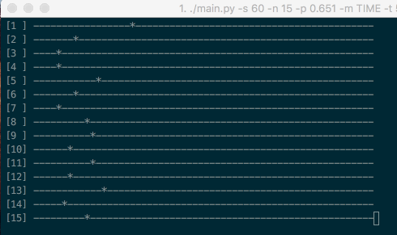

# crystal-python-multithreading
Multithreaded modelling of the movement of particles in a crystal

The program describes a physical process of the motion of particles in a crystal. The crystal is a 1-dimensional object with a size of N. Each of K particles at every step commits a [random walk](https://en.wikipedia.org/wiki/Random_walk). 

<div style="text-align:center"></div>

The main file could be executed with different parameters, to see all of them type the following

```bash
$ python main.py --help [-h]
```

Available arguments are:

```bash
usage: main.py [-h] [-s SIZE] [-n NUM_PARTICLES] [-p PROBA] [-m {TIME,ITER}]
               [-t TIME] [-d DELAY] [-i NUM_ITERS] [--visualise]

Run commands

optional arguments:
  -h, --help            show this help message and exit
  -s SIZE, --size SIZE  Size (length) of a 1D-Crystal
  -n NUM_PARTICLES, --num-particles NUM_PARTICLES
                        Number of workers (particles in a crystal)
  -p PROBA, --proba PROBA
                        Probability of a particle to move right
  -m {TIME,ITER}, --mode {TIME,ITER}
                        Mode that the program will work in
  -t TIME, --time TIME  Program execution time limit in seconds
  -d DELAY, --delay DELAY
                        Time each particle will sleep between iterations in
                        milliseconds
  -i NUM_ITERS, --num_iters NUM_ITERS
                        Maximum number of iterations each particle does
  --visualise           Visualise a crystal to see positions of particles
```

There are two two main operating modes:

1. **{TIME}** is used to limit a program execution time
2. **{ITER}** is used to limit a number that each particle of the crystal does

### Examples

```bash
$ python main.py --num_particles 10 --proba 0.73 --mode "TIME" --time 20 --delay 300  --visualise
```

```bash
$ python main.py --num_particles 5 --mode "ITER" --num_iterations 100000 --visualise
```

```bash
$ python main.py -s 100 -n 25 -p 0.27 -m "TIME" -t 45
```

### Notes
`curses` library is used to visualise the movement on-the-fly. Since this library works properly only on UNIX environment, it would be better for Windows users to use Cygwin terminal or to disable a visualization.
